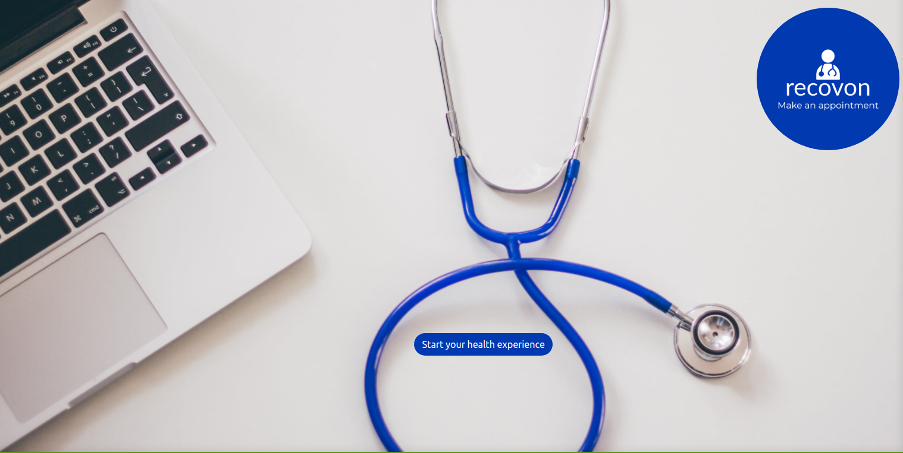
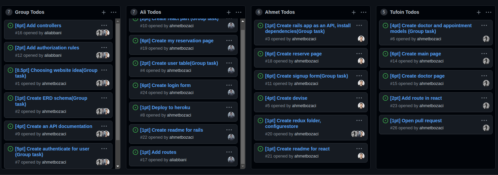

[](https://www.microverse.org/?grsf=04r25h)

# RECOVON 

## Be Online Be Healthy Be Happy

- Recovon app aimed at helping patients where ever they are in the world
- They can book an appointment with a doctor.
- There are different doctors to choose from so your health is always assured by one of them
- API created with ruby on rails.
- You can create your appointment and see them on my appointment page

The app consumes an API created using the Ruby on Rails framework. 
[Backend Repo link](https://github.com/ahmetbozaci/recovon-backend)  

<!-- Add screenshot, add description of website etc-->


## Built With

- React
- Redux
- React-Bootstrap

## Live Demo

[]()

## Kanban Board
- Final number of team member is 3.
- [Kanban Board link](https://github.com/ahmetbozaci/recovon-backend/projects/1)

## Setup
- Clone this project
```
- $ git clone https://github.com/ahmetbozaci/recovon-frontend
- $ cd recovon-frontend
```
- Install npm packages
```
- $ npm install
```
- Open website
```
- $ npm start
```
## Authors

👤 **Ali Abbani**
- [GitHub](https://github.com/aliabbani)
- [AngelList](https://angel.co/u/ali-abbani)
- [LinkedIn](https://www.linkedin.com/in/ali-abbani-8b6246150/)

👤 **Ahmet Bozacı**
- [Github](https://github.com/ahmetbozaci)
- [Twitter](https://twitter.com/ahmtbozaci)
- [LinkedIn](https://www.linkedin.com/in/ahmetbozaci/)

👤 **Tufoin Nkuo**
- [GitHub](https://github.com/tufoinnkuo10)
- [Twitter](https://twitter.com/itztenten)
- [LinkedIn](https://www.linkedin.com/in/tufoin-nkuo-3b272320b)


## 🤝 Contributing

Contributions, issues, and feature requests are welcome!

Feel free to check the [issues page](../../issues/).

## Show your support

Give a ⭐️ if you like this project!

## Acknowledgments

- A special thanks to [Microverse](https://www.microverse.org/?grsf=04r25h) for inspiring this project. We are indebted to you all at Microverse
- A special thanks goes to all our peers at [Microverse](https://www.microverse.org/?grsf=04r25h) for being there for us.

## 📝 License

* This project is [MIT](./LICENSE) licensed.
* [Creative Common License of design](https://creativecommons.org/licenses/by-nc/4.0/)
* Original design idea by [Murat Korkmaz on Behance](https://www.behance.net/gallery/26425031/Vespa-Responsive-Redesign)
